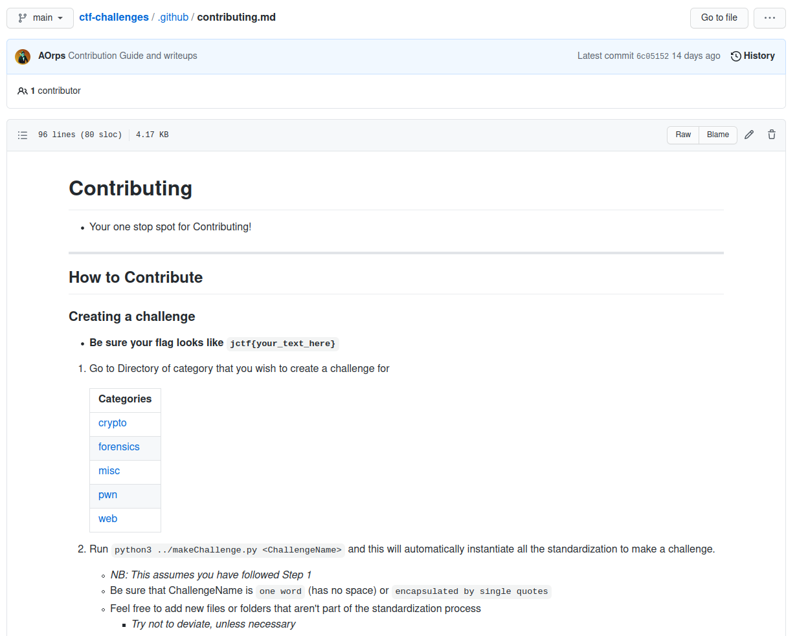

# contributing.md

A `contributing.md` should describe how contributors can work within the repository. Anc describe how they can do good work.
* This file can be found in `docs/`, `.github/`, or in the project's repository root. 

---

For the **repository owner**, contribution guidelines are a way to communicate how people should contribute.

For **contributors**, the guidelines help them verify that they're submitting well-formed pull requests and opening useful issues.

For both **owners and contributors**, contribution guidelines save time and hassle caused by improperly created pull requests or issues that have to be rejected and re-submitted.

---

An example of a good [`contributing.md`](https://github.com/njitacm/ctf-challenges/blob/main/.github/contributing.md) can be found [here](https://github.com/njitacm/ctf-challenges/blob/main/.github/contributing.md)

---

## Resources
* [Setting guidelines for repository contributors](https://docs.github.com/en/communities/setting-up-your-project-for-healthy-contributions/setting-guidelines-for-repository-contributors)
* [Example **contributing.md**](https://github.com/njitacm/ctf-challenges/blob/main/.github/contributing.md)

---

[next](license.md)