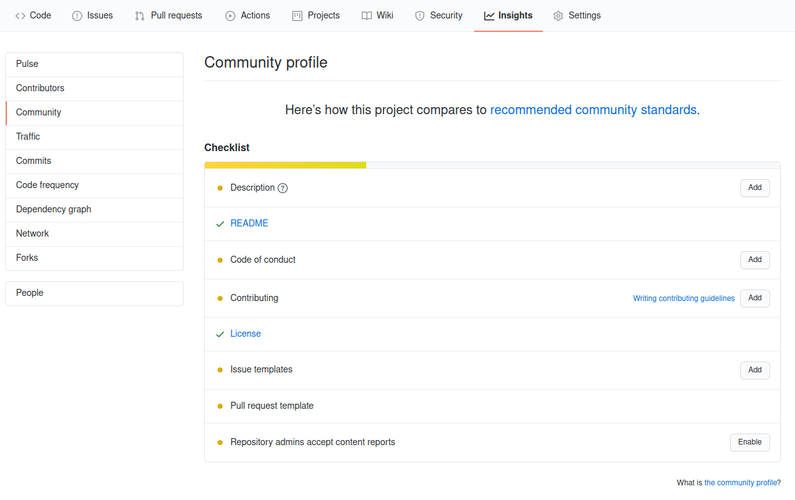

# Contributing to Open Source (and make your repository more friendly to fellow developers)

## How to contribute to Open Source

* (This is generally the standard, however each repo is unique in it's own way)

1. **Fork** github repository 
    
1. _**(In a terminal)**_ **Clone** forked repository and move to cloned Directory 
    * `git clone https://github.com/<your-username>/<repoName>.git`
    * `cd <repoName>`
1. **Create** and **Switch** to new branch
    * `git checkout -b <branch name>` <!--`git checkout -b` is actually based-->
1. Make changes to the selected branch on the forked repository
1. After your changes are done, change Directory until you are at repository's root
1. Git Add Files
    * `git add .`
1. Git Commit
    * `git commit -m "<Describe edits / commit>"`
1. Git Push
    * `git push origin <branch name>`
1. With everything pushed onto Github, [follow this last tutorial](https://docs.github.com/en/github/collaborating-with-issues-and-pull-requests/creating-a-pull-request) and you should be on your way!

---

## How to make your Repo more friendly to fellow developers

* Check the `Insights Tab > Community` 

* The more a project owner adds from the the Community Section, the more friendly the repo is to other devs
    * Like in all github things, the ***more green the better***. So turn that yellow progress bar into a green one.  

---

## Resources

---

[start over](../README.md)