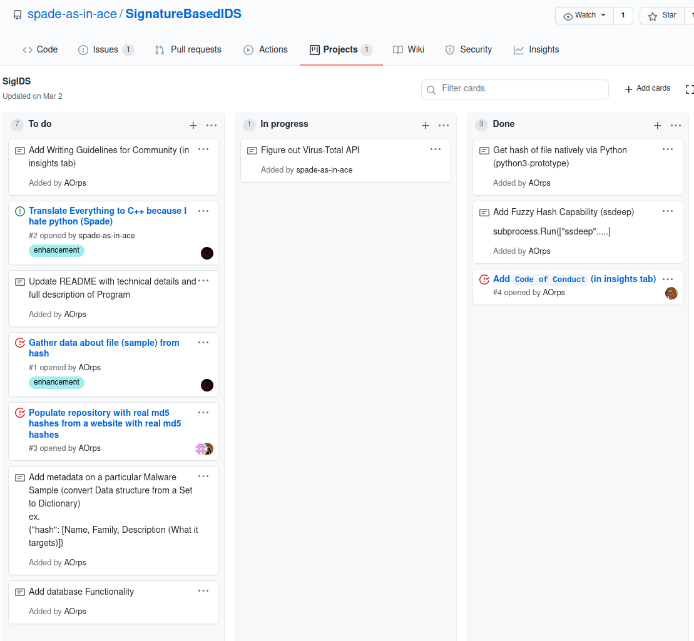

# Projects

**Using a Kanban on Github to Optimize Workflow**

If you know what trello is, think of Trello but directly embedded into Github. That is what Projects are.

Project boards on GitHub help you **organize** and **prioritize** your work. You can create project boards for specific feature work, comprehensive roadmaps, or even release checklists. With project boards, you have the flexibility to create customized workflows that suit your needs.

One such board is a [**Kanban**](https://kanbanize.com/kanban-resources/getting-started/what-is-kanban). Kanbans are really effective productivity tools that can help **streamline** tasks and makes a difference in an unorganized organization.
* Offers insight into:
    * the progress of a task
    * the tasks that are being worked on
    * (With Issues) can prevent a collision or 2 people working on the same tasks. 

Check [link](https://docs.github.com/en/github/managing-your-work-on-github/about-project-boards) for creating your own Projects

---

## Resources

* [About project boards](https://docs.github.com/en/github/managing-your-work-on-github/about-project-boards)
* [What is a Kanban?](https://kanbanize.com/kanban-resources/getting-started/what-is-kanban)

---

[next](oss.md)